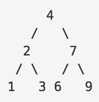
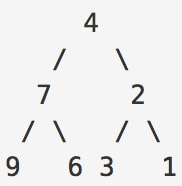

# Invert Binary Tree

## Premise

-	Your challenge is to take a binary tree and invert it. If you don't know what a binary tree is, follow this link: http://cslibrary.stanford.edu/110/BinaryTrees.html

for example, say you have a tree that looks like the following

after your program runs, it should return a tree that looks like this

-	Your program should run on any size tree. What is the runtime and space of your algorithm? Do you think it's reasonable? These are important questions you should ask yourself when creating these types of solutions.
