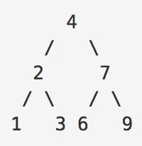
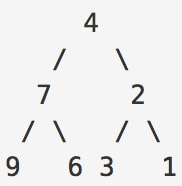

#Challenge 4 Documentation - _OkraArmband_

The main Python file `challenge_4.py` contains the code necessary to create, reverse, and print a binary tree.
For the purposes of this exercise, a "binary tree" means to refer to a structure containing three units: a main unit
and two child units (called "left" and "right"). Each child unit, itself, can be a binary tree and thus have a 
never-ending series of children. However, the "main" unit of each tree will have stored in it some value (usually numeric).

The method, then, for reversing a binary tree in total is to "flip" the references to the children at each node.
That is, to make the left child become the right child and vice versa. To that end, `challenge_4.py` contains three
relevant functions that need to be accessed by the user (all of which are contained in the class of objects BinaryTree):
* `from_list(var)`
* `invertTree(obj)`
* `printTree(obj)`

## `from_list`
To create a BinaryTree object, one calls the constructor `from_list(var)` using a list as the input `var`. For example,
to construct a simple tree with 2 as the root, 1 as the left child, and 3 as the right child, one would call
`BinaryTree.from_list([2,1,3])`. Note that the format for the input list must always be `[root, left, right]`.
If children of the main tree themselves have children, then a nested list must be implemented in the construction. 

For the following binary tree binary tree

and store the result into an `example` variable, the command would be: `example = BinaryTree.from_list([4,[2,1,3],[7,6,9]])`.

To alter this binary tree so that 9 has the right child: 10, but no left child, then the call becomes: `example = 
BinaryTree.from_list[4,[2,1,3],[7,6,[9,None,10]]]`. The `None` is _required_ when children do not exist.

## `invertTree`

To invert an existing BinaryTree object, simply call this method on the instance of the object. In the image example
given in the previous section, we could call the lines:  
`example = BinaryTree.from_list([4,[2,1,3],[7,6,9]])`  
`example.invertTree()`  
And now our tree is the following:

with its list strcture being `[4,[7,9,6],[2,3,1]]`.

## `printTree`

For a given BinaryTree object, call printTree to display the entries at every node contained in the object. For properly
structured binary search trees (BSTs), this will print of list of numbers sorted from lowest to highest (or in reverse
for trees reversed with `invertTree`).  
Example:  
 >`example = BinaryTree.from_list[4,[2,1,3],[7,6,9]]`  
 >`example.printTree()`
   
Output:  
 >1   
 >2  
 >3  
 >4  
 >7  
 >6  
 >9