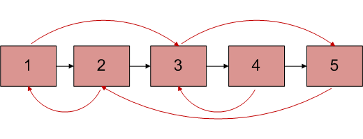

Random Pointer Linked List
======
Idea
------
You are given a  linked list, nothing unusual about that right? The kicker is that aside from the normal "next" attribute each node has, they also have a "random" attribute. The "random" attribute is essentially a reference to any other node in the linked list. For example, take a look at the linked list below.

 

Just a normal Linked List right? Right. Nothing special about it what so ever. Now lets take a look at a linked list with random pointers.

 

Your job is to create a function "deep_copy" (or whatever you want to call it), that, when given the root of a linked list with random pointers, can construct a deep copy of it. 

"What is a deep copy?" You ask. A deep copy is a copy of a "structure" but with no references what so ever to the origina. For more information take a look at http://stackoverflow.com/questions/184710/what-is-the-difference-between-a-deep-copy-and-a-shallow-copy

For the purpose of this challenge, each node in the list has three attributes. Next, random and data (normally in this problem "data" is excluded). For the sake of testing, the deep-copies "data" field should have the original copies data but it should end with a \'. In other words if we have one node whose data is "A", the deep copy of that node has A' as its data.

For information on how to construct the random pointer linked list, see the testing section.

Testing
------
Testing for this is a bit difficult. 

In order to test your function I would suggest manually making a linked list then setting random pointers to random nodes.

Once complete, run the head of your linked list through your function and catch the new head. Essentially just make sure the random pointers point to the correct node. Perhaps compare the data values of the new list to that of the original (minus the ').